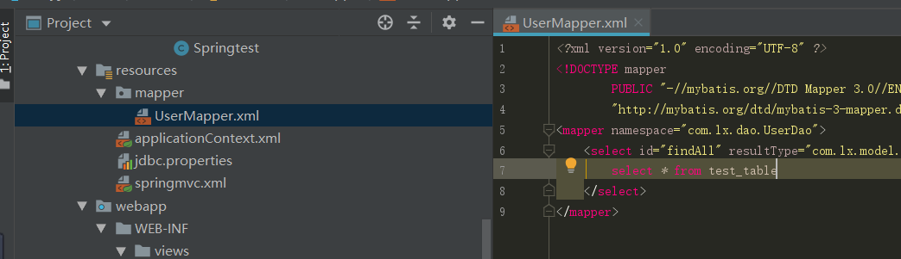

# IntegrateSSM
My First SSM  pj
At present, I have only built the most basic framework

### 搭建最基本的SSM框架

#### 1.创建好Maven结构，具体步骤请见[如何创建maven项目]( https://www.cnblogs.com/qinxu/p/9648429.html )

#### 2.进行Spring模块的整合

##### 2.1首先在pom.xml文件中引入spring所需的依赖关系

```xml
<!--    统一控制版本-->   
<properties>
        <project.build.sourceEncoding>UTF-8</project.build.sourceEncoding>
        <maven.compiler.source>1.7</maven.compiler.source>
        <maven.compiler.target>1.7</maven.compiler.target>
        <spring.version>5.2.4.RELEASE</spring.version>
        <java.servlet.version>4.0.1</java.servlet.version>
        <jstl.version>1.2</jstl.version>
    </properties>

<!--    spring配置-->
        <dependency>
            <groupId>org.springframework</groupId>
            <artifactId>spring-core</artifactId>
            <version>${spring.version}</version>
        </dependency>

        <!-- https://mvnrepository.com/artifact/org.springframework/spring-context -->
        <dependency>
            <groupId>org.springframework</groupId>
            <artifactId>spring-context</artifactId>
            <version>${spring.version}</version>
        </dependency>

        <dependency>
            <groupId>org.springframework</groupId>
            <artifactId>spring-beans</artifactId>
            <version>${spring.version}</version>
        </dependency>

        <dependency>
            <groupId>org.springframework</groupId>
            <artifactId>spring-context-support</artifactId>
            <version>${spring.version}</version>
        </dependency>

        <dependency>
            <groupId>org.springframework</groupId>
            <artifactId>spring-aop</artifactId>
            <version>${spring.version}</version>
        </dependency>

        <dependency>
            <groupId>org.springframework</groupId>
            <artifactId>spring-aspects</artifactId>
            <version>${spring.version}</version>
        </dependency>

        <dependency>
            <groupId>org.springframework</groupId>
            <artifactId>spring-expression</artifactId>
            <version>${spring.version}</version>
        </dependency>

        <dependency>
            <groupId>org.springframework</groupId>
            <artifactId>spring-tx</artifactId>
            <version>${spring.version}</version>
        </dependency>

        <dependency>
            <groupId>org.springframework</groupId>
            <artifactId>spring-test</artifactId>
            <version>${spring.version}</version>
        </dependency>

        <dependency>
            <groupId>org.springframework</groupId>
            <artifactId>spring-web</artifactId>
            <version>${spring.version}</version>
        </dependency>
```

其中${spring.version}获取property配置中的版本号

##### 2.2在resources文件目录下创建一个spring配置文件文件名为==applicationContext.xml==

	

在applicationContext.xml文件中配置扫描包路径

	

##### 2.3在web.xml文件中配置启动器，监听器

```xml
    <!--  配置spring配置文件-->
    <context-param>
        <param-name>contextConfigLocation</param-name>
        <param-value>classpath:applicationContext.xml</param-value>
    </context-param>

    <!--  配置监听器-->
    <listener>
        <listener-class>org.springframework.web.context.ContextLoaderListener</listener-class>
    </listener>
```

之后可以进行spring整合测试,我在我的主目录及测试目录分别下创建了一个测试文件

	

	

主目录内容为

```java
package com.lx.ssmpj;

import org.springframework.stereotype.Service;

@Service
public class Springtest {

    //    测试方法
    public void sayHello() {
        System.out.println("hello ssm test!");
    }

    public void pringtHello() {
        sayHello();
    }
}
```

在在测试类中进行

```java
package com.lx.ssmpj;

import org.junit.Test;
import org.springframework.context.ApplicationContext;
import org.springframework.context.support.ClassPathXmlApplicationContext;
import org.springframework.stereotype.Service;

@Service
public class test {
    @Test
    public void pringtHello(){
//        获取配置文件
        ApplicationContext applicationContext=new ClassPathXmlApplicationContext("applicationContext.xml");
//        获取方法注意方法名一定要小写！！！！
        Springtest ts= (Springtest) applicationContext.getBean("springtest");
//        调用方法
        ts.pringtHello();
    }
}


```

会看到输出hello ssm test!表示成功

	

#### 3.进行SpringMVC模块的整合

##### 3.1首先在pom.xml文件中引入springmvc所需的依赖关系

```xml
 <!--        springmvc配置-->
        <!-- https://mvnrepository.com/artifact/org.springframework/spring-webmvc -->
        <dependency>
            <groupId>org.springframework</groupId>
            <artifactId>spring-webmvc</artifactId>
            <version>${spring.version}</version>
        </dependency>

        <!-- https://mvnrepository.com/artifact/javax.servlet/javax.servlet-api -->
        <dependency>
            <groupId>javax.servlet</groupId>
            <artifactId>javax.servlet-api</artifactId>
            <version>${java.servlet.version}</version>
            <scope>provided</scope>
        </dependency>

        <!-- https://mvnrepository.com/artifact/javax.servlet.jsp.jstl/jstl-api -->
        <dependency>
            <groupId>javax.servlet.jsp.jstl</groupId>
            <artifactId>jstl-api</artifactId>
            <version>${jstl.version}</version>
        </dependency>
```

##### 3.2在resources文件目录下创建一个springmvc配置文件,文件名为==spring-mvc.xml==,配置视图解析器和控制器

```xml
    <!--    万能解决路径问题-->
    <mvc:annotation-driven/>

    <!--    扫描路径-->
    <context:component-scan base-package="com.lx.controller"/>

    <!--    配置视图解析器-->
    <bean class="org.springframework.web.servlet.view.InternalResourceViewResolver">
        <!--        jstl视图配置-->
                <property name="viewClass" value="org.springframework.web.servlet.view.JstlView"/>
        <!--        配置前后缀-->
        <property name="prefix" value="/WEB-INF/views/"/>
        <property name="suffix" value=".jsp"/>
    </bean>
```

##### 3.3在web.xml中配置DispatcherServerlet

```xml
<!--    配置前端拦截器-->
    <servlet>
        <servlet-name>springDispatcherServlet</servlet-name>
        <servlet-class>org.springframework.web.servlet.DispatcherServlet</servlet-class>
<!--        配置springmvc配置文件-->
        <init-param>
            <param-name>contextConfigLocation</param-name>
            <param-value>classpath:springmvc.xml</param-value>
        </init-param>
        <load-on-startup>1</load-on-startup>
    </servlet>

<!--    映射拦截路径-->
    <servlet-mapping>
        <servlet-name>springDispatcherServlet</servlet-name>
        <url-pattern>/</url-pattern>
    </servlet-mapping>
```

#### 4.进行Mybatis模块的整合

##### 4.1首先在pom.xml文件中引入Mybatis所需的依赖关系

```xml
  <!--mybatis配置-->
        <!-- https://mvnrepository.com/artifact/mysql/mysql-connector-java -->
        <dependency>
            <groupId>mysql</groupId>
            <artifactId>mysql-connector-java</artifactId>
            <version>${mysql.connector.version}</version>
        </dependency>

        <!-- https://mvnrepository.com/artifact/com.alibaba/druid -->
        <dependency>
            <groupId>com.alibaba</groupId>
            <artifactId>druid</artifactId>
            <version>${druid.version}</version>
        </dependency>

        <!-- https://mvnrepository.com/artifact/org.springframework/spring-jdbc -->
        <dependency>
            <groupId>org.springframework</groupId>
            <artifactId>spring-jdbc</artifactId>
            <version>${spring.version}</version>
        </dependency>

        <!-- https://mvnrepository.com/artifact/org.mybatis/mybatis -->
        <dependency>
            <groupId>org.mybatis</groupId>
            <artifactId>mybatis</artifactId>
            <version>${mybatis.version}</version>
        </dependency>

        <!-- https://mvnrepository.com/artifact/org.mybatis/mybatis-spring -->
        <dependency>
            <groupId>org.mybatis</groupId>
            <artifactId>mybatis-spring</artifactId>
            <version>${mybatis-spring.version}</version>
        </dependency>
```

##### 4.2在resources文件目录下创建一个数据库配置文件和一个Mapper映射文件,文件名分别为==jdbc.properties==

jdbc.properties配置文件:

```properties
jdbc.driverClassName=com.mysql.cj.jdbc.Driver
jdbc.url=jdbc:mysql://localhost:3306/myssmdb?serverTimezone=GMT&characterEncoding=UTF-8
jdbc.username=root
jdbc.password=123456
```

mapper文件路径如下:



##### 4.3在applicationContext.xml文件中配置数据库连接池等配置文件

```xml
 <!--    读取jdbc配置文件-->
    <context:property-placeholder location="classpath:jdbc.properties" ignore-unresolvable="true"/>

    <!--    配置数据源-->
    <bean id="dataSource" class="com.alibaba.druid.pool.DruidDataSource">
        <property name="driverClassName" value="${jdbc.driverClassName}"/>
        <property name="url" value="${jdbc.url}"/>
        <property name="username" value="${jdbc.username}"/>
        <property name="password" value="${jdbc.password}"/>
    </bean>

    <!--    配置sqlSessionFactory工厂，注入数据源-->
    <bean id="sqlSessionFactory" class="org.mybatis.spring.SqlSessionFactoryBean">
        <property name="dataSource" ref="dataSource"/>
        <property name="mapperLocations" value="classpath:mapper/*.xml"/>
    </bean>

    <!--    配置事务处理-->
    <bean id="sqlSession" class="org.mybatis.spring.SqlSessionTemplate">
        <constructor-arg index="0" ref="sqlSessionFactory"/>
    </bean>

    <!--    配置扫描Dao接口包，动态实现Dao接口，注入到spring容器中 -->
    <bean id="mapperScannerConfigurer" class="org.mybatis.spring.mapper.MapperScannerConfigurer">
        <!--        配置工厂类管理-->
        <property name="sqlSessionFactoryBeanName" value="sqlSessionFactory"/>
        <!--        配置扫描包名-->
        <property name="basePackage" value="com.lx.dao"/>
    </bean>
```


